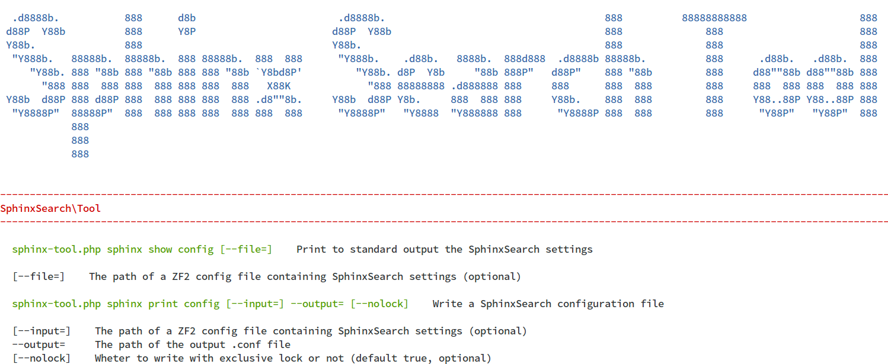

**Sphinx Search Tool** is an utility that provides a set of tools to **create Sphinx Search configurations and data sources**.

[](https://packagist.org/packages/ripaclub/zf2-sphinxsearch-tool) [](https://github.com/ripaclub/zf2-sphinxsearch-tool/blob/master/LICENSE) [](https://www.versioneye.com/php/ripaclub:zf2-sphinxsearch-tool)

## Features

* Console actions about Sphinx Search **configurations**

    * A **variable substitutions mechanism** (see [here](#configuration))
    
    * An automated way to **build** a Sphinx Search **configuration** from a ZF2 configuration (e.g. a PHP file returning a configuration array)
    
    * A set of already defined useful variables, particularly the UTF-8 **charset tables**
    
        - `charset_utf8_digits`, map to tokenize only digits
        
        - `charset_utf8_alphabet`, case-insensitive map for [ISO basic latin alphabet](http://en.wikipedia.org/wiki/ISO_basic_Latin_alphabet)
        
        - `charset_utf8_latin_extra`, table for special latin chars
         
        - `charset_utf8_a` to `charset_utf8_z` maps that normalize diacritics
         
        - `charset_utf8_default`, map that merge all the previous togheter
        
        - language based charse tables, e.g. `charset_utf8_it`, `charset_utf8_en`, `charset_utf8_de`, `charset_utf8_es`, `charset_utf8_zh`, `charset_utf8_ja`, ... 

* Classes to generate Sphinx Search **data source files or streams**

    * Class to generate **XML** data for `xmlpipe2` (see [docs](http://sphinxsearch.com/docs/current.html#xmlpipe2))
    
    * Class to generate **TSV** data for `tsvpipe` (see [docs](http://sphinxsearch.com/docs/current.html#tsvpipe))

* Can be used from command line as a **standalone CLI tool** or can be installed as a **ZF2 module**

## References

- [Sphinx Search configuration options](http://sphinxsearch.com/docs/current.html#conf-reference)

## Requirements

 * Zend Framework 2.0.0 or later
 
 * PHP 5.4.0 or later
 
 * Console access to the application being maintained (shell, command prompt)

## Installation

### Standalone installation using [composer](http://getcomposer.org)

 1. Open console (command prompt)
 
 2. `git clone https://github.com/ripaclub/zf2-sphinxsearch-tool.git`
 
 3. `cd zf2-sphinxsearch-tool`
 
 4. Run `composer install`

### Installation as ZF2 module using [composer](http://getcomposer.org)

 1. Open console (command prompt)
 
 2. Go to your application's directory
 
 3. Add the following to your **composer.json**

```json
{
    ...,
    "require": {
        "ripaclub/zf2-sphinxsearch-tool": "dev-develop"
    },
    "repositories": [
        {
        "type": "vcs",
        "url": "https://github.com/ripaclub/zf2-sphinxsearch-tool.git"
        }
    ]
}
```

 4. Run a `composer update`

## Usage

The entry point of the tool is the `sphinx-tool.php` file.

So executing it without commands, i.e. `php -f sphinx-tool.php`, the help message will be shown.

The usage of this tool is self-explanatory.

You can output (as array) to your console the Sphinx Search settings stored in the ZF2 configuration files (e.g. `module.config.php`) or in an external configuration file (e.g. `sphinx.conf.php`).

The Sphinx Search settings here specified will be merged with the default settings contained in ZF2 Sphinx Search Tool.

```bash
php -f sphinx-tool.php sphinx show config
php -f sphinx-tool.php sphinx show config --file=sphinx.conf.php
```

Also, you can directly write the configuration in the Sphinx Search format.

```bash
php -f sphinx-tool.php sphinx print config --output=config/sphinx.dev.conf
php -f sphinx-tool.php sphinx print config --input=sphinx.conf.php --output=config/sphinx.dev.conf
```

##### Note

If you use ZF2 Sphinx Search Tool as a module included into your application you can call its actions from your application entry point.

### Configuration

A Sphinx Search configuration can be defined via the `sphinxsearch` node element into you ZF2 configurations. The children of this node will be merged (i.e. added or substituted to) with defaults provided by ZF2 Sphinx Search Tool.

It can have this children:

- `variables`

    This node contains the variables that will be substituted into all your Sphinx Search configuration options.
    Some default variables are `log_path`, `lib_path`, `run_path`, and `idx_path` (respectively set to `/var/log/sphinx`, `/var/lib/sphinx`, `/var/run/sphinx`, and `/var/idx/sphinx`).
    You can define your variables (or override the defaults) and use them into your other settings wrapping them inside brackets.

- `searchd`

    Insert here your [search configuration options](http://sphinxsearch.com/docs/current.html#confgroup-searchd)

- `indexer`

    Insert here your [indexer configuration options](http://sphinxsearch.com/docs/current.html#confgroup-indexer)
    
- `common`

    Insert here your [common section configuration options](http://sphinxsearch.com/docs/current.html#confgroup-common)

- `indexes`

    This node contains the configurations of your indexes as an associative array which keys corresponds to index names.
    For each index you defined you have to specify its [options](http://sphinxsearch.com/docs/current.html#confgroup-index) via associative arrays (also multidimensional if needed)

- `sources`

    This node contains the configurations of you data source as an associative array which keys corresponds to source names.
    For each data source you defined you have to specifiy its [options](http://sphinxsearch.com/docs/current.html#confgroup-source) via associative arrays (also multidimensional if needed)
    
#### Example

An example of PHP array that defines a Sphinx Search configuration:

```php
return [
    'sphinxsearch' => [
        'variables' => [
            'idx_path' => '/path/to/idx'
        ],
        'searchd' => [
            'listen' => '9306:mysql41',
            'log' => '{log_path}/searchd.log',
            'query_log' => '{log_path}/query.log',
            'pid_file' => '{run_path}/searchd.pid',
            'workers' => 'threads',
            'binlog_path' => '{lib_path}',
            'sphinxql_state' => '{run_path}/state.sql',
        ],
        'indexer' => [
            'mem_limit' => '512M',
            'write_buffer' => '16M',
        ],
        'indexes' => [
            'realtime' => [
                'type' => 'rt',
                'path' => '{idx_path}/realtime',
                'rt_field' => ['title', 'content'],
                'rt_attr_uint' => 'gid',
            ],
            'main' => [
                'source' => 'main',
                'path' => '{idx_path}/main',
            ],
            'delta : main' => [
                'source' => 'delta',
                'path' => '{idx_path}/delta',
            ]
        ],
        'sources' => [
            'main' => [
                'sql_query_pre' => ['SET NAMES utf8', 'REPLACE INTO sph_counter SELECT 1, MAX(id) FROM documents'],
                'sql_query' => 'SELECT id, title, body FROM documents WHERE id<=(SELECT max_doc_id FROM sph_counter WHERE counter_id=1)',
            ],
            'delta : main' => [
                'sql_query_pre' => 'SET NAMES utf8',
                'sql_query' => 'SELECT id, title, body FROM documents WHERE id>(SELECT max_doc_id FROM sph_counter WHERE counter_id=1)',
            ]
        ]
    ]
];
```

### Create data sources

Suppose you have a result set (e.g. variable `$results`) obtained from a database (e.g. MongoDB) and you want to index it with Sphinx Search to serve searches through a plain index.

First of all we need to create a data source (e.g. an `xmlpipe2` source) that will stream our documents to the standard output (for this purpose we do not specify any URI for the writer).

```php
use SphinxSearch\Tool\Source\Writer\XML2;
...
    $writer = new XML2();
    $writer->setFields(
        [
            ['name' => 'name', 'attr' => 'string'],
            ['name' => 'type'],
        ]
    );
    $writer->setAttributes(
        [
            ['name' => 'lat', 'type' => 'float'],
            ['name' => 'lng', 'type' => 'float'],
            ['name' => 'price', 'type' => 'int'],
        ]
    );
    echo $writer->beginOutput();
    $count = 1;
    foreach ($results as $result) {
        $document = [
            'id'                 => $count,
            'name'               => $result['name'],
            'lat'                => deg2rad(floatval($result['lat'])),
            'lng'                => deg2rad(floatval($result['lng'])),
            'price'              => (int) $result['price'],
        ];
        echo $writer->addDocument($document);
        $count++;
    }
    echo $writer->endOutput();
...
```

Suppose to wrap previous code in a controller console action (i.e. `sphinx xmlpipe2`), we can therefore use it as our `xmlpipe_command` to populate the Sphinx Search index.

The `sphinx.config.php` of our project is:

```php
return [
    'sphinxsearch' => [
        'indexes' => [
            'my_idx' => [
                'type' => 'plain',
                'path' => '{idx_path}restaurant_it',
                'source' => 'my_source',
                'dict' => 'keywords',
                'charset_type' => 'utf-8',
                'charset_table' => '{charset_utf8_default}',
            ],
        ],
        'sources' => [
            'my_source' => [
                'type' => 'xmlpipe2',
                'xmlpipe_command' => '/usr/bin/php -f /path/to/project/public/index.php sphinx xmlpipe2'
            ]
        ]
    ]
];
```

We can now generate the `sphinx.conf`:
 
```bash
./vendor/bin/sphinx-tool.php sphinx print config --input=sphinx.config.php --output=sphinx.conf
```

Everything is now ready. We can call the indexer command (i.e. `indexer -c sphinx.conf --all --rotate`) and serve searches.

---

[](https://github.com/igrigorik/ga-beacon)
